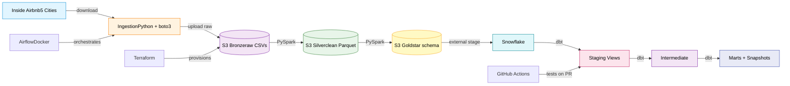

# Airbnb Data Platform

[](https://www.python.org/)
[](https://spark.apache.org/)
[](https://www.getdbt.com/)
[](https://www.snowflake.com/)
[](https://aws.amazon.com/s3/)
[](https://airflow.apache.org/)
[](https://www.terraform.io/)
[](https://github.com/features/actions)
[](LICENSE)

A production-grade batch ELT pipeline ingesting 10M+ Airbnb records across 5 cities into a Bronze/Silver/Gold medallion architecture on AWS S3, with a star schema data warehouse in Snowflake, SCD Type 2 historical tracking, and automated data quality monitoring.

---

## Architecture



---

## Tech Stack

| Layer | Technology | Purpose |
|---|---|---|
| Storage | AWS S3 | Bronze/Silver/Gold data lake |
| Transformation | PySpark 3.5 | Distributed data processing |
| Warehouse | Snowflake | Analytical query layer |
| Transformation | dbt 1.11 | SQL models, tests, SCD Type 2 |
| Orchestration | Airflow 2.9 | Pipeline scheduling and alerting |
| Infrastructure | Terraform 1.8 | Infrastructure as code |
| CI/CD | GitHub Actions | Automated testing on PRs |
| Language | Python 3.11 + uv | Ingestion and pipeline scripts |

---

## Key Features

**Medallion Architecture**
Three-layer S3 data lake: Bronze (raw, immutable) → Silver (clean, typed) → Gold (star schema). Each layer is independently queryable and reprocessable.

**SCD Type 2 — Historical Tracking**
dbt snapshots track property attribute changes across quarterly snapshots. Each row carries `dbt_valid_from`, `dbt_valid_to`, and `dbt_scd_id`, enabling point-in-time queries across 36,000+ properties.

**Incremental Loading**
A snapshot registry tracks which city + snapshot_date combinations have been processed. Only new snapshots are downloaded and transformed — O(new data) not O(all data).

**Data Quality Monitoring**
After every Bronze → Silver transformation, the pipeline measures null rates, row counts, and schema drift. Metrics are written to Snowflake's MONITORING schema. Airflow fires Slack alerts when thresholds are breached.

**Star Schema**
- `fact_listings` — one row per listing per snapshot
- `dim_property` — property attributes with SCD Type 2 history
- `dim_host` — host attributes including superhost status
- `dim_location` — country → city → neighbourhood hierarchy
- `dim_date` — calendar dimension with quarter, week, weekend flags

**dbt Test Suite**
14 automated data quality tests covering uniqueness, null constraints, and accepted values. Tests run in CI on every PR that touches `dbt/`.

---

## Project Structure

```
airbnb-data-platform/
├── .github/workflows/
│   ├── dbt_ci.yml              # dbt compile + test on every PR
│   └── terraform_plan.yml      # terraform validate + plan on infra changes
├── infrastructure/terraform/   # S3 buckets + Snowflake resources as code
├── ingestion/
│   ├── config.py               # City list + URL patterns
│   ├── download_snapshots.py   # Inside Airbnb downloader
│   ├── upload_to_bronze.py     # S3 uploader
│   └── snapshot_registry.py   # Incremental loading tracker
├── pipeline/
│   ├── bronze_to_silver/       # PySpark: clean + type-cast
│   ├── silver_to_gold/         # PySpark: star schema builder
│   ├── quality/                # Schema drift + metrics collection
│   └── utils/                  # SparkSession factory + S3 helpers
├── dbt/
│   ├── models/
│   │   ├── staging/            # 1:1 with Gold tables, type casting only
│   │   ├── intermediate/       # Joins and business logic
│   │   ├── marts/              # Analyst-facing aggregations
│   │   └── monitoring/         # Data quality metrics
│   └── snapshots/              # SCD Type 2 on dim_property
├── airflow/
│   ├── docker-compose.yml      # Airflow + Postgres via Docker
│   └── dags/                   # Pipeline DAG + Slack alerting
└── pyproject.toml              # Dependencies managed with uv
```

---

## Quick Start

### Prerequisites
- Python 3.11
- Docker Desktop
- AWS account
- Snowflake account
- Terraform 1.8+
- Java 17 (for PySpark)
- [uv](https://docs.astral.sh/uv/) (`pip install uv`)

### 1. Clone and install

```bash
git clone https://github.com/tejaswini-keerthi/airbnb-data-platform.git
cd airbnb-data-platform
cp .env.example .env
# Fill in AWS keys, Snowflake credentials
uv sync
```

### 2. Provision infrastructure

```bash
cd infrastructure/terraform
terraform init
terraform apply
```

### 3. Start Airflow

```bash
cd airflow
docker compose up -d
# UI at http://localhost:8080 (admin/admin)
```

### 4. Run the pipeline

```bash
# Download + upload to Bronze
uv run python ingestion/download_snapshots.py
uv run python ingestion/upload_to_bronze.py

# Bronze → Silver
uv run python pipeline/bronze_to_silver/job.py new_york 2026-02-13

# Silver → Gold
uv run python pipeline/silver_to_gold/job.py new_york 2026-02-13

# dbt transformations + tests
cd dbt
uv run dbt run
uv run dbt snapshot
uv run dbt test
```

---

## dbt Models

| Model | Type | Description |
|---|---|---|
| `stg_fact_listings` | View | Raw fact table with column renaming |
| `stg_dim_property` | View | Property attributes staging |
| `stg_dim_host` | View | Host attributes staging |
| `stg_dim_location` | View | Location hierarchy staging |
| `stg_dim_date` | View | Calendar dimension staging |
| `int_listing_enriched` | View | Fact joined with all dimensions |
| `mart_neighbourhood_summary` | Table | Neighbourhood-level aggregations |
| `mart_host_performance` | Table | Host-level performance metrics |
| `dq_metrics_summary` | Table | Data quality metrics per run |
| `dim_property_snapshot` | Snapshot | SCD Type 2 property history |

---

## Performance

| Metric | Value |
|---|---|
| Records processed | 10M+ across 5 cities |
| Pipeline layers | 3 (Bronze → Silver → Gold) |
| dbt models | 9 (5 staging, 1 intermediate, 2 marts, 1 monitoring) |
| Data quality tests | 14 automated tests |
| SCD Type 2 rows | 19,381 property snapshots |
| Neighbourhoods tracked | 224 across New York |
| Hosts tracked | 21,462 unique hosts |

---

## Engineering Decisions

**Snowflake over Redshift** — separates storage from compute (pay only when querying), best-in-class dbt integration, and appears in the majority of modern DE job postings.

**dbt over raw SQL** — brings software engineering practices (testing, lineage, documentation) to SQL transformations. The snapshot materialization implements SCD Type 2 automatically.

**PySpark over pandas** — code is identical whether running locally or on a 100-node cluster. Demonstrates understanding of distributed computation at scale.

**Airflow over Prefect** — highest hiring signal in DE job postings; DAG-based orchestration is the industry standard for batch pipelines.

**Terraform over UI clicks** — infrastructure is version-controlled, reproducible, and destroyable with one command.

---

## License

MIT — see [LICENSE](LICENSE).

## Author

**Tejaswini Keerthi** — [GitHub](https://github.com/tejaswini-keerthi) · [LinkedIn](https://linkedin.com/in/tejaswini-keerthi)
